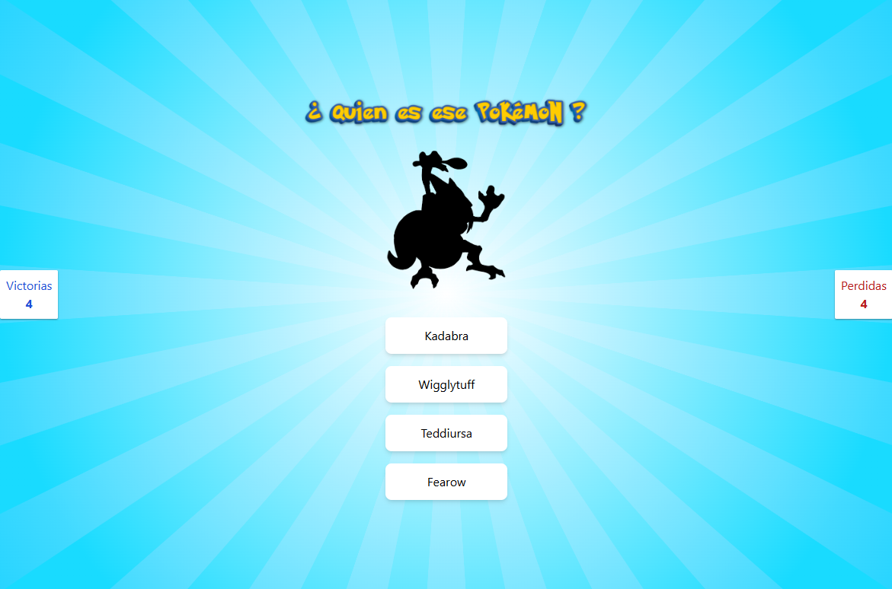

# Pokémon Game

¡Descubre quién es ese Pokémon! Este proyecto es un divertido juego interactivo desarrollado con **Vue.js 3**, que utiliza composables personalizados para el manejo del estado, **Tailwind CSS** para estilos modernos y **Vitest** para pruebas unitarias.

## 🌐 Despliegue en Netlify

El proyecto está desplegado en Netlify y puedes probarlo aquí:  
[Pokémon Game en Netlify](https://poke-game-tamara.netlify.app/)

---

## 🛠 Tecnologías utilizadas

- **Vue.js 3**: Framework progresivo para crear interfaces de usuario.
- **Tailwind CSS**: Framework de utilidades para estilos rápidos y consistentes.
- **Vite**: Herramienta de desarrollo rápida y moderna.
- **Vitest**: Framework para pruebas unitarias.
- **Composables personalizados**: Manejo del estado reactivo y lógica reutilizable.
- **TypeScript**: Para tipado estático y detección temprana de errores.
- **ESLint**: Para mantener un código limpio y consistente.

---

## 🚀 Características principales

- **¿Quién es ese Pokémon?**: Juego interactivo para adivinar el Pokémon en pantalla.
- **Manejo de estado con composables**: Más flexible y modular que un store tradicional.
- **Estilos modernos y responsivos**: Diseño con **Tailwind CSS**.
- **Pruebas unitarias**: Asegura la calidad del código con **Vitest**.
- **Alto desempeño**: Gracias a **Vite** como bundler.

---

## 📦 Configuración del proyecto

Sigue estos pasos para configurar y ejecutar el proyecto localmente:

### 1. Clona el repositorio

git clone https://github.com/tu-usuario/pokemon-game.git

### 2. Compila y recarga en modo desarrollo

npm run dev

### 3. Verifica el tipado y compila para producción

npm run build

### 4. Ejecuta pruebas unitarias

npm run test:unit

### Analiza el código con ESLint [ESLint](https://eslint.org/)

# pokemon-game

📸 Capturas de pantalla
**Vista principal de la aplicación**

